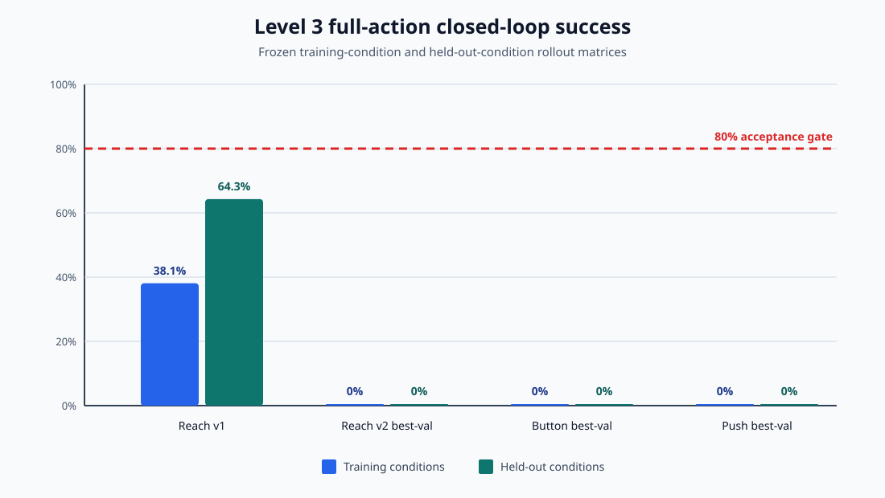
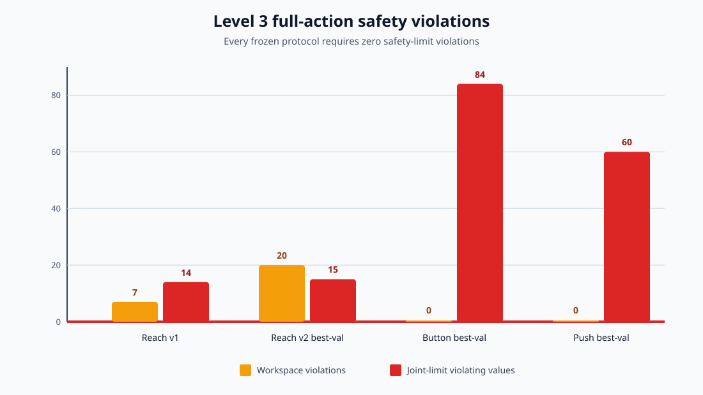

# Level 3 Learning Feasibility Results

Report version: `level3/feasibility-report-v1`

Date: September 3, 2026

Machine-readable evidence: `outputs/level3/feasibility_v1/summary.json`

## Decision

Level 3 produces a split decision:

- **Go** for the saved-data learning pipeline. Deterministic whole-episode
  splits, training-only normalization, CPU behavior-cloning training,
  best-validation checkpoint selection, digest verification, and frozen
  headless rollout evaluation all work reproducibly.
- **No-go** for qualifying or deploying any policy trained from the Level 2
  release. No validation-selected full-action policy passed a frozen
  closed-loop gate, including on its training conditions.
- **Go** for Level 4 requirements and collection work. The next experiment
  needs broader, session-aware data and a safer action contract before Level 5
  qualification; it does not need an untriggered GRU or a larger model merely
  to continue the roadmap.

The no-go applies to the tested Level 2 data and Level 3 policy family. It is
not evidence that behavior cloning or dexterous policy learning is generally
infeasible.

## Experiment boundary

The immutable Level 2 v1 release contains 55 clean reach successes, 55 clean
button successes, and 101 clean push successes. All three learning datasets use
`level2/observation-layout-v2` observations and the complete
`level1.13/full-action-v1` action layout. The release manifest records that
genuine recording-session ids are unavailable and that no cross-session claim
is made.

The policies are two-hidden-layer, state-based, goal-conditioned MLPs with 128
units per layer. They consume saved state and typed goals, not images. Full
policies predict 27 named values: base position, base quaternion orientation,
and 20 wrist/finger actuator targets. Checkpoint selection uses only offline
validation loss. Held-out rollouts never select an epoch, hyperparameter,
threshold, or protocol setting.

## Provenance

The complete machine-readable trace, including source paths and full SHA-256
values, is in `outputs/level3/feasibility_v1/summary.json`. The key experiment
identifiers are:

| Result | Training config SHA-256 | Dataset digest | Split-manifest digest | Checkpoint SHA-256 | Protocol digest | Rollout-report SHA-256 |
|---|---|---|---|---|---|---|
| Reach v1, final epoch | `cb434b20ca0b4b7193c218b98c57a4df5dc9e5ab04df50d437251eab60380fd3` | `b37aa514642e329b28e220568869b755587a43f53ea7b4b06f2cb608598cf7e8` | `3074749edf0368c3a8d41be5470a995eb24ac87bcb7e48422fe7738fc9b5f19b` | `8ae19960d877a46010191c68743ee7337dbc90fbe094b4286955688f50488bbc` | `3a4a2a60530dd7bbea0d310d9ef4401810704bcb1e4e18f3ba0cc4dea5e8d143` | `7d5533b14998d0eb5e06eb0bbebd5e8a0327cfe87eb57f252f3cabf4f595842d` |
| Reach v2, best validation | `f534a9cf69e6c7096cea0c8dd8d3cc535fcc11eb20fb8ff1f81e94b0bf0ddf29` | `b37aa514642e329b28e220568869b755587a43f53ea7b4b06f2cb608598cf7e8` | `3074749edf0368c3a8d41be5470a995eb24ac87bcb7e48422fe7738fc9b5f19b` | `d30f3122b50047693426aa7eb3e52616e7c0d1a8b3174370703ee313aade5356` | `3a4a2a60530dd7bbea0d310d9ef4401810704bcb1e4e18f3ba0cc4dea5e8d143` | `df014a3a9adfe87ede2e2e9d6555e6830dff69041fae5b1e22ae3ae020ae16b0` |
| Button v1, best validation | `8501aa5c7742382a8dcbaf563cb17e8116034974c787500fc5132ba00d55043f` | `9626a8c7a9b1d48ed51403313a786afe2828051460834e4705e832ec67f832c0` | `3c82c4fbce01a4f096c971fa44685f5c5c6cda6ed344b71e11db4826953f5572` | `e8f4be66f624f4ffce9661ac41983141b2e7d408a559258fd2cec124a3497920` | `c2342bfaf0fb84a7cc0602e04c8f17760d2953619c4275ddd33ae67804a698d2` | `30223814ffef3a48301bccbb85cf74bdf5371ebca61ccacff936ef5d4415bddd` |
| Push v1, best validation | `79cfc80e93c867f34722d7a8b417839d0932b6bbdbf2b2d65fd0321a23735974` | `1b142e430f1d4ee42b97c8ec9dfbb6b751ca619a46432263d1e95d011939fcd3` | `2d97b056f205e50bd0753c74cd845304053dad86bfaedf05dcc36bcec66c3d18` | `dd0ac9bad222749b12f301009f68359743c8c3f67a25b6c1d22d076f1cedce36` | `5cd217efb303d50afbab4d77aaf59efd7f92b736ce7e0c5ae7dfe25e5d0625ee` | `159528e71def9c752a218371494230b47a4008bd534f232894db3abf145c4b37` |

The diagnostic matrix is bound to
`configs/level3_diagnostics.yaml` at SHA-256
`9ff07a689f285c1e77e1cfb80d644fbfc1408245dcf8f2118ea22189ef51b9de`
and `outputs/level3/diagnostics_v1/report.json` at SHA-256
`3ff69461dfe54e1eb8131e89e533af686d9e4a41f7dab4e23a028e747730072a`.
The Level 2 release manifest is SHA-256
`efc79c3ad87123f79efd3da8d53ddb0592f85d329c73fefe39fa525877534187`;
the archive digest recorded inside it is
`f35851d6b6bb4efd8ffa0f011d6130558f2b2902c38d8568a271bd71f09c002b`.

## Offline versus closed-loop results

| Policy | Offline checkpoint | Frozen scenarios | Training success | Held-out success | Mean final task error | Mean normalized jerk | Workspace violations | Joint-limit violating values | Passed |
|---|---:|---:|---:|---:|---:|---:|---:|---:|---|
| Reach v1 | Epoch 100, loss `0.095581` | 35 | 38.1% | 64.3% | `0.05906 m` | `0.04060` | 7 | 14 | No |
| Reach v2 best-validation | Epoch 15, loss `0.066874` | 35 | 0.0% | 0.0% | `0.29156 m` | `0.19560` | 20 | 15 | No |
| Button best-validation | Epoch 17, loss `0.046794` | 84 | 0.0% | 0.0% | `0.01192 m` depth shortfall | `0.00000` | 0 | 84 | No |
| Push best-validation | Epoch 97, loss `0.000686` | 30 | 0.0% | 0.0% | `0.18011 m` planar distance | `0.00000` | 0 | 60 | No |

The zero jerk for button and push is not a positive smoothness result: every
scenario terminated at the first control step because of joint-limit
violations. All failures remain in the corresponding reports.

The original reach v1 run evaluated epoch 100 even though epoch 15 had the
lowest offline validation loss. Level 3.5B repaired checkpoint selection and
wrote v2 artifacts without changing the dataset, split, seed, model, epoch
budget, 35-scenario matrix, gates, or protocol digest. The corrected v2 result
was worse in closed loop: training success fell by 0.381, held-out success by
0.643, mean final error rose by 0.23250 m, workspace violations increased by
13, and joint-limit violations increased by one. This protocol-preserving
negative result is evidence that offline validation loss is not a sufficient
proxy for closed-loop utility on this dataset.

## Diagnostic findings

The Level 3.6 matrix compared full, base-only, finger-only, and fixed-goal
policies under each task's unchanged split, seed, model width, scenario order,
and frozen evaluation protocol.

- Reach base-only control removed the full policy's 20 workspace and 15
  joint-limit violations and reduced mean final error from 0.29156 m to
  0.11051 m, but training and held-out success remained zero.
- Button base-only control improved both training and held-out success from
  zero to 0.333 and removed all 84 joint-limit violations. It still failed,
  with 56 workspace violations and mean depth shortfall of 0.008 m.
- Button fixed-training-mean goal input reached 0.190 training and held-out
  success, so goal conditioning was not the only source of failure. It also
  retained 12 joint-limit and 56 workspace violations.
- No reach or push ablation produced nonzero success. Adding the 14
  quality-failed but recomputed-successful reach episodes changed neither
  training nor held-out success and terminated all 35 scenarios through
  joint-limit violations.
- Button and push have no recomputed-success episodes outside their clean sets,
  so a broader-data comparison is unavailable for those tasks.

These are measured action-layout and safety effects. They do not identify a
successful action subset, and they do not establish that any one model change
would solve the problem.

## Temporal baseline decision

Level 3.7 closed as **not justified**. Button and push terminate after a mean
of one control step, and reach failures are dominated by immediate workspace
or joint-limit termination. The completed diagnostics contain no state-aliasing,
history-conditioned-error, or controlled error-accumulation measurement.
Compounding error and missing recovery coverage therefore remain hypotheses.

A short-history model should be reconsidered only after a targeted diagnostic
shows either that indistinguishable current states require materially different
actions that history resolves, or that errors accumulate after action layout
and safety handling are held fixed.

## What Level 3 proves—and does not prove

Supported claims:

- The released state/action data can be loaded through executable schemas,
  split without episode leakage, normalized from training data only, and used
  for deterministic CPU behavior-cloning experiments.
- Frozen training-condition and held-out-condition MuJoCo rollouts can be run
  and audited with exact dataset, config, split, schema, checkpoint, protocol,
  and rollout provenance.
- The tested single-step, full-action MLP baselines are not feasible for
  qualification on the frozen Level 3 gates.
- Base/finger action grouping materially changes closed-loop safety and button
  success, although no tested variant passes.

Unsupported claims:

- Cross-session, cross-operator, cross-camera, or cross-lighting
  generalization. The Level 2 metadata has no genuine session ids.
- Cross-object or open-world generalization. Push uses one cube instance;
  reach uses three fixed targets; button uses one board with three buttons and
  a narrow depth grid.
- Pick, lift, place, regrasp, recovery, perception-grounded execution, or
  long-horizon composition. None was trained or evaluated.
- A causal temporal, recovery-coverage, or state-distribution-shift diagnosis.
- Autonomous deployment or skill qualification for any Level 3 checkpoint.

## Data gaps

| Dimension | Reach | Button | Push | Level 4 response |
|---|---|---|---|---|
| Task coverage | Contact-only reach; no object approach orientation or disturbance gate | Press depth/state only | Planar push only | Add typed reach-object, pick, place-held, push-object, and press skills with executable phase and terminal metrics |
| Session/operator | No genuine session ids; operator diversity not auditable | Same | Same | Require genuine `recording_session_id`, pseudonymous `operator_id`, and whole-session validation/test ownership |
| Object/fixture | Three fixed target sites | One board and three button ids | One cube instance | Use three rigid-object families, at least two instances per family, named fixtures, and held-out instances |
| Goal/reset coverage | Three training poses; two rollout-only poses | Nine training button/depth cells; three rollout-only interpolations; fixed initial base pose | Three fixed lanes; three rollout-only starts/targets; fixed object/base orientation | Cover safe interior and near-boundary resets, varied approach poses, source/target regions, direction, mass, friction, and instance geometry |
| Outcome/failure | Training uses clean successes; broader-success comparison still failed | All 55 demonstrations are clean successes | All 101 demonstrations are clean successes | Retain ordinary failures, policy rollouts, and safe corrections separately; label failure class, retryability, and intervention interval |
| Observation | State and task metrics; no policy RGB | State and button metrics; no policy RGB | State and cube metrics; no policy RGB | Add typed world state, support/held/contact relations, previous applied action, phase, safety masks, and aligned single-camera RGB annotations |
| Action/safety | Full action couples base and finger outputs; safety failures vary by subset | Base-only helps but trades joint violations for workspace violations | Every full rollout terminates on joint limits | Preserve the full named action, add separate bounded residual base/finger heads and deterministic safety supervision, and collect safe boundary coverage without demonstrating unsafe motion |

## Recommended Level 5 starting point

Retain the existing goal-conditioned MLP as a reproducible reference baseline,
not as a candidate for qualification. The recommended Level 5 candidate is a
per-skill, phase-conditioned state policy with:

- separate bounded residual heads for base pose and wrist/finger commands;
- the previous commanded and applied action as explicit inputs;
- task/phase-specific action relevance while preserving the complete named
  action contract;
- deterministic workspace, object-workspace, joint-limit, stale-state, and
  timeout supervision outside the learned model.

This recommendation follows the measured action-subset and immediate-safety
effects. Its advantage is not yet measured and must be compared against the
reference MLP using the frozen Level 4 splits. A temporal model remains
conditional on the Level 3.7 reassessment trigger. Visual learning should
populate a typed object-observation interface; a VLM or image policy must not
bypass metric pose validation or the safety supervisor.

## Required Level 4 fields

Observations and labels:

- Named base pose/velocity and wrist/finger joint position/velocity.
- Previous commanded action, previous applied action, and clipping/safety
  masks so commanded versus executed behavior is distinguishable.
- Typed goal, active internal phase, task progress, terminal metrics, and
  missing/stale-state masks.
- Per-entity identity, class, pose, velocity, support, held, contact,
  confidence, source, timestamp, units, and coordinate frame.
- One synchronized fixed-camera RGB stream with intrinsics/extrinsics, object
  boxes, masks, visibility, ids, and 6D-pose annotations.

Collection metadata:

- Genuine session id, stable pseudonymous operator id, episode id, source
  category, object instance ids, and frozen goal-condition id.
- Sampled initial state, reset seed, camera/render calibration, teleoperation
  configuration, and code/config/schema versions.
- Monotonic phase intervals and aligned state/action/task/image timestamps.
- Failure class, retryability, source policy/checkpoint, intervention bounds,
  and final outcome for failures and corrections.
- Quality, replay, relabel, split, and per-file SHA-256 provenance.

## Provisional Level 4 coverage and counts

Level 4.0 must freeze exact ids and cells, and Level 4.3 may revise counts from
pilot timing and rejection evidence. Until then, the evidence supports the
existing 250–350 new-episode envelope:

| Data group | Estimated coverage cells | Minimum accepted | Planning target |
|---|---:|---:|---:|
| Reach object or fixture approach | 10 entity/approach-class cells | 30 | 30–40 |
| Complete pick/place sequence | 30 cells: 6 instances × 5 targets | 120 | 120–150 |
| Push to zone | 20 cells: 2 push-compatible families × 5 targets × 2 start/direction bands | 40 | 40–55 |
| Button press | 10 depth/state × approach/reset cells | 30 | 30–40 |
| Ordinary failures and safe corrections | 9 required failure-class cells, with safety violations abort-only | 30 | 30–50 |
| **Required total** | — | **250** | **250–350** |

The matrix must span at least three genuine sessions. With three sessions,
sessions A/B form the training pool and session C remains untouched for test;
with four or more, reserve whole validation and test sessions. Held-out object
instances and goal regions remain test-only. Counts are global accepted-episode
counts, not permission to duplicate one trajectory across cells or splits.

The optional dial remains zero in the required budget. If Level 4.3 promotes
it after a successful pilot, its 30–40 episodes are additional and may not
reduce required-skill coverage.

## Level 4 roadmap impact

No scope correction to `docs/progress_level_4.md` is needed in this checkpoint.
Its existing Level 4.0 traceability freeze, five-skill workcell, session-aware
schema, phase labels, failures/corrections, aligned single-camera annotations,
250–350 episode envelope, split audit, and immutable release requirements
already address the measured Level 3 gaps. Level 4.0 remains responsible for
turning this provisional report into the frozen machine-readable collection
specification. No Level 4.0 implementation is included here.
